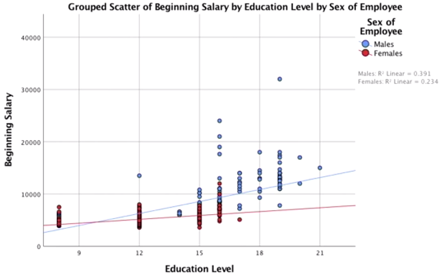

# SPSS-Labs

This is a repository to keep track Machine Learning and AI trainings with [SPSS](https://www.ibm.com/analytics/spss-statistics-software).

## SPSS Trial

SPSS trial can be downloaded from this [link](https://www.ibm.com/account/reg/us-en/signup?formid=urx-19774).

- No credit card is required, just create the account
- 14-day trial period begins immediately after registration

The complete training can be found in this [link](https://www.linkedin.com/learning-login/share?forceAccount=false&redirect=https%3A%2F%2Fwww.linkedin.com%2Flearning%2Fmachine-learning-ai-foundations-linear-regression%3Ftrk%3Dshare_ent_url&account=2130250).

- A [LinkedIn Learning](https://en.wikipedia.org/wiki/LinkedIn_Learning) account is required

## Annotations

### Statistical significance

Statistical significance is the *likelihood that a relationship between two or more variables is caused by something other than chance*. Statistical hypothesis testing is used to determine whether the result of a data set is statistically significant.

It is represented by *Sig* or called *p-value*.****

### Observation

An observation in statistics is a value of something of interest you're measuring or counting during a study or experiment: a person's height, a bank account value at a certain point in time, or number of animals.

It is represented by an N.

### OLS - Ordinary Least Squares Regression

Ordinary least squares (OLS) regression is a statistical method of analysis that estimates the **relationship** between one or more **independent variables** and a **dependent variable**; the method estimates the relationship by minimizing the sum of the squares in the difference between the observed and predicted values of the dependent variable configured as a straight line. In this entry, OLS regression will be discussed in the context of a bivariate model, that is, a model in which there is only one independent variable ( X ) predicting a dependent variable ( Y ). However, the logic of *OLS regression is easily extended to the multivariate model* in which there are two or more independent variables.

### Dependent variable

A dependent variable represents a quantity whose value depends on how the independent variable is manipulated.
y is often the variable used to represent the dependent variable in an equation.

- Dependent variable will always go into the Y axis

### Independent variable

An independent variable is a variable that represents a quantity that is being manipulated in an experiment.
x is often the variable used to represent the independent variable in an equation.

### [Scatter Plots](https://en.wikipedia.org/wiki/Scatter_plot)

Scatter Plot with very week relationship will be accumulated in near to a single point.

Data points can have undue influence.'

#### Scatter Plot Matrix

A scatter plot matrix is a grid (or matrix) of scatter plots used to visualize bivariate relationships between combinations of variables. Each scatter plot in the matrix visualizes the relationship between a pair of variables, allowing many relationships to be explored in one chart.

### Mean vs Median

- If data is normally distributed the mean and the median will be quite close

- If Mean is larger than the mean, then it means that there there is a positive skew
  - Skewness will be bigger than 1

## Checking Regression Assumptions

- Put all relevan variables in the model
  - Check to see if the residuals plot show a random pattern
  - Check for the presence of interactions
- Leave the irrelevan variables out
  - Check for the significance of each IV (Independent Variable) and check the partial plots for each IV
- Need linear relationships
  - Simpler: use curve estimation and scatter plots to diagnose
- Residuals have a mean of zero
- Normality errors
  - Check the normality of IVs using Levene's test before building the model
  - check for normality of residuals after building
  - Check the mean error of the residuals
- Multicollinearity
  - Correlation matrix before you model
  - Collinearity diagnostics after you model
- Serial autocorrelation (time series data)
  - If every row in data is in some sequence
- Durbin-Watson test

## Dummy Coding

Whenever you have a categorical variable, you're gonna have to prepare the data by performing what we call dummy coding. So if you have a categorical variable, you simply cannot feed this directly into your regression.

So what you have to do, is if you have original variable with four categories in it, you have to create four new variables.

| Original Variable | Cat1_yn | Cat2_yn | Cat3_yn | Cat4_yn |
| -------------------- | ------- | ------- | ------- | ------- |
| *Category 1*         | **1**   | 0       | 0       | 0       |
| *Category 2*         | 0       | **1**   | 0       | 0       |
| *Category 3*         | 0       | 0       | **1**   | 0       |
| *Category 4*         | 0       | 0       | 0       | **1**   |

There is an [extension](https://www.ibm.com/support/knowledgecenter/cs/SSLVMB_24.0.0/spss/programmability_option/python_uber_installed_extensions.html) in SPSS to create the Dummy Coding

## Detecting Variable Interactions

Book: [Multiple Regression: Testing and Interpreting Interactions - By Leona S. Aiken, Stephen G. West, Raymond R. Reno](https://www.worldcat.org/title/multiple-regression-testing-and-interpreting-interactions/oclc/682063599)

An interaction will be present when the slope of the blue line is not the same as the slope of the red line. Because what this tells us, is that the gap between the blue line and the red line are not uniform. The gender gap at high levels of education is wide. And the gender gap at low levels of education is more narrow. To put it another way, the nature of the gap between men and women depends on upon another variable, education. Or, one more way to phrase it, the impact of education on salary depends upon another variable, namely, sex of employee. So, an interaction is present here and there are two consequences of that fact.

### Centering

Centering simply means subtracting a constant from every value of a variable. What it does is redefine the 0 point for that predictor to be whatever value you subtracted. It shifts the scale over, but retains the units. The effect is that the slope between that predictor and the response variable doesn't change at all.

- In other cases, just substract the average of the variable, *Centering of X1 = (Total of X1 - AVG(Total of X1))*.
- Then *X1_X2 = Centering of X1 by X2*
- Then create the plot with : Y vs [Centering of X1, X2, X1_x2]
- X1_X2 should be significant, meaning, way below of standard cutoff of *0.05* for *95%* confidence
- The r squared is higher than it would be certainly if we took that interaction variable out

## 3 Styles of doing regression

|                                 | Hierarchical                                           | Simultaneous                                                                | Stepwise                                                                    |
| ---------------------------------- | ------------------------------------------------------ | --------------------------------------------------------------------------- | --------------------------------------------------------------------------- |
| Style                              | Most Academic                                          |                                                                             | Least Academic, more common in marketing research                           |
| Theory                             | Strong, 'detailed' theory                            | Limited Theory                                                              | No Theory                                                                   |
| Case Study Dataset Used            | MWBank                                                 | Waste                                                                       | Auto Imports                                                                |
| Analyst role in picking
variables  | Choose variables AND the 'order' of the variables      | Choose variables only, so 'theory' is simply that this list is a good list. | SPSS chooses the variables AND the order. Analyst does not choose.          |
| Most important details to report   | the Order that you chose and delta R2                  | std. beta coefficients, the significance of the variables                   | The order that SPSS loaded the variables, and which variables were left out |
| Extra Stats to request             | delta R2, its significance and the 'part' correlations | partial correlations                                                        | secondary importance, delta R2                                              |
| Extras that are always a good idea | Residual Plot, Partial Plots, Collinearity Diagnostics | Residual Plot, Partial Plots, Collinearity Diagnostics                      | Residual Plot, Partial Plots, Collinearity Diagnostics                      |

Some definitions of Partial Correlationship can be found in the IBM knowledge center in this [link](https://www.ibm.com/support/knowledgecenter/es/SSLVMB_24.0.0/spss/base/idh_part.html)